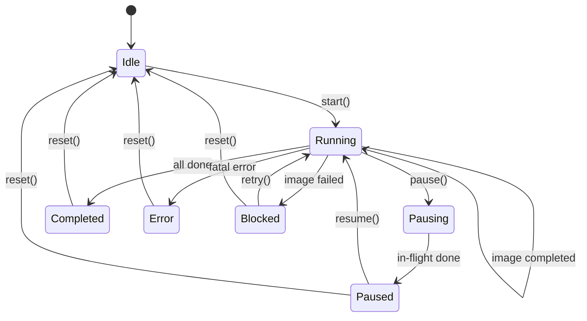
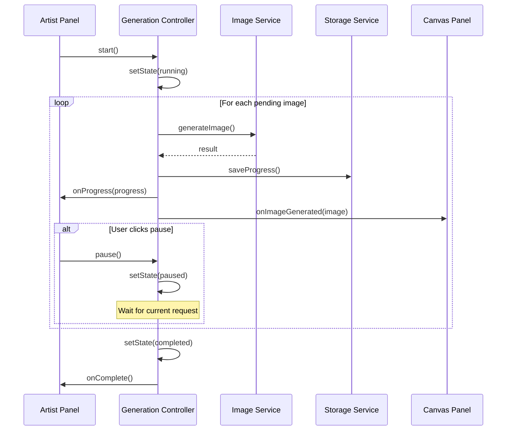

# Design Document: Artist Image Generation Optimization

## Overview

本设计文档描述美工阶段图片生成流程的优化方案。核心目标是实现：
1. 可暂停/继续的生成流程
2. 实时展示每张生成的图片
3. 智能重试失败图片（跳过已成功的）

设计采用状态机模式管理生成流程，通过回调机制实现实时更新，利用现有 IndexedDB 存储实现状态持久化。

## Architecture



### 组件交互流程



## Components and Interfaces

### 1. GenerationController

生成控制器，管理整个生成流程的状态和执行。

```typescript
/** 生成状态 */
// Note: "blocked" is a non-fatal stop caused by a single-image failure requiring user action.
// If you want to avoid adding a new state, you can model this as state='paused' + reason='failed'.
// This spec treats it as a distinct state for clarity.
export type GenerationState = 'idle' | 'running' | 'pausing' | 'paused' | 'blocked' | 'completed' | 'error';

/** 生成控制器配置 */
export interface GenerationControllerConfig {
  projectId: string;
  onProgress?: (progress: GenerationProgress) => void;
  onImageGenerated?: (image: GeneratedImage, phase: GenerationPhase) => void;
  onStateChange?: (state: GenerationState) => void;
  onComplete?: (result: GenerateAllImagesResult) => void;
  onError?: (error: string) => void;
}

/** 生成控制器接口 */
export interface IGenerationController {
  /** 当前状态 */
  readonly state: GenerationState;
  
  /** 开始生成 */
  start(): Promise<void>;
  
  /** 暂停生成 */
  pause(): void;
  
  /** 继续生成 */
  resume(): Promise<void>;
  
  /** 重置状态 */
  reset(): void;
  
  /** 重试失败的图片 */
  retryFailed(options?: { includePending?: boolean }): Promise<void>;
  
  /** 重新生成单张图片 */
  regenerateSingle(imageId: string, phase: GenerationPhase): Promise<GeneratedImage | null>;
  
  /** 获取当前进度 */
  getProgress(): GenerationProgress;
  
  /** 获取失败的图片列表 */
  getFailedImages(): GeneratedImage[];
  
  /** 是否有失败的图片 */
  hasFailedImages(): boolean;
}
```

### 2. GenerationQueue

生成队列，管理待生成的图片任务。

```typescript
/** 队列项 */
export interface QueueItem {
  id: string;
  promptId: string;
  prompt: string;
  phase: GenerationPhase;
  name: string;
  referenceUrl?: string;  // 用于 img2img
  status: 'pending' | 'generating' | 'completed' | 'failed';
}

/** 生成队列接口 */
export interface IGenerationQueue {
  /** 添加任务 */
  enqueue(item: QueueItem): void;
  
  /** 获取下一个待处理任务 */
  dequeue(): QueueItem | null;
  
  /** 获取所有待处理任务 */
  getPending(): QueueItem[];
  
  /** 获取所有失败任务 */
  getFailed(): QueueItem[];
  
  /** 更新任务状态 */
  updateStatus(id: string, status: QueueItem['status']): void;
  
  /** 重置失败任务为待处理 */
  resetFailed(): void;
  
  /** 清空队列 */
  clear(): void;
  
  /** 队列是否为空 */
  isEmpty(): boolean;
  
  /** 获取队列长度 */
  size(): number;
}
```

## Key Concepts (补充约束，避免实现歧义)

### 1) Image Identity & Slot Model

要满足“逐张展示 + 失败只补失败 + 成功不动”，需要一个稳定的“图片槽位”与唯一标识：

- **稳定唯一键（建议）**：`imageKey = ${phase}:${promptId}`
- **槽位创建时机**：`start()` 时一次性创建所有槽位（先占位 `status=pending`），画布按既定顺序渲染占位符
- **槽位更新规则**：
  - 单张成功：只更新对应 `imageKey` 的槽位为 `completed`，填充 `imageUrl/assetId`
  - 单张失败：只更新对应 `imageKey` 的槽位为 `failed`，填充 `error`
  - 重试：只对 `failed`（以及可选 `pending`）槽位再次发起请求并覆盖该槽位

> 说明：当前项目类型定义里 `GeneratedImage.status` 已使用 `'pending' | 'generating' | 'completed' | 'failed'`，本设计与之保持一致。

### 2) Pause Semantics (精确定义)

- `pause()` 调用后立即进入 `pausing`：停止调度新的任务（不再发起新请求）
- 若存在“已在途请求”，允许其自然完成（成功或失败均可），完成后进入 `paused`
- `resume()` 从 `paused` 继续处理下一批 `pending` 任务

### 3) Retry Semantics (与原始诉求对齐)

原始诉求是“未生成成功的都要补齐”。因此建议：

- `retryFailed({ includePending: true })`（默认 `true`）：对 `failed + pending` 重新入队/调度
- `retryFailed({ includePending: false })`：仅补失败（更严格意义的 retry）

### 4) Stop-on-Failure Semantics (已确认：失败即阻塞)

为满足“遇到失败就停止，等待用户操作”的交互：

- 任意图片生成失败后：
  - 控制器停止调度新的任务（不再发起新请求）
  - 控制器进入 `blocked`
  - UI 展示失败原因，并提示用户点击“重新生成（补未成功）”或“重置”
- `retryFailed({ includePending: true })` 在 `blocked` 状态下可作为恢复手段：
  - 优先重试 `failed`
  - 然后继续处理剩余 `pending`
  - 成功后回到 `running`

## Persistence Strategy (与现有 IndexedDB 对齐)

项目数据本身已通过 `updateProject()` 写入 IndexedDB，因此本方案的“持久化”重点是 **写入频率与时机**：

- 每张图片生成完成（成功/失败）后，立即把对应槽位写回 `project.artist` 并 `updateProject()`
- 恢复时，从 `project.artist` 直接恢复槽位列表与状态，并推送到画布（避免重新生成已成功图片）

### 3. 更新后的 artistService 接口

```typescript
/** 创建生成控制器 */
export function createGenerationController(
  config: GenerationControllerConfig
): IGenerationController;

/** 从项目状态恢复控制器 */
export function restoreGenerationController(
  projectId: string,
  config: Omit<GenerationControllerConfig, 'projectId'>
): Promise<IGenerationController>;

/** 获取待生成的图片数量 */
export function getPendingImageCount(projectId: string): Promise<{
  characters: number;
  scenes: number;
  keyframes: number;
  total: number;
}>;

/** 获取失败的图片列表 */
export function getFailedImages(projectId: string): Promise<{
  characters: GeneratedImage[];
  scenes: GeneratedImage[];
  keyframes: GeneratedImage[];
}>;
```

## Data Models

### GenerationProgress (更新)

```typescript
export interface GenerationProgress {
  /** 当前状态 */
  state: GenerationState;
  /** 当前阶段 */
  phase: GenerationPhase;
  /** 当前阶段已完成数量 */
  current: number;
  /** 当前阶段总数量 */
  total: number;
  /** 总体已完成数量 */
  overallCompleted: number;
  /** 总体总数量 */
  overallTotal: number;
  /** 当前正在生成的图片名称 */
  currentItem?: string;
  /** 失败数量 */
  failedCount: number;
  /** 错误信息 */
  error?: string;
}
```

### ArtistData (保持兼容)

现有的 `ArtistData` 结构保持不变，通过 `GeneratedImage.status` 字段区分图片状态：
- `pending`: 待生成
- `generating`: 生成中
- `completed`: 已完成
- `failed`: 失败

## Decisions (已确认)

（已确认）
1. **失败是否继续**：遇到失败即阻塞（Stop-on-Failure）
2. **重试是否包含 pending**：`includePending=true`（补齐未成功：failed + pending）
3. **并发策略**：允许并发，展示顺序可“谁先完成先展示”（仍按稳定槽位更新）
4. **关键帧退化策略**：不允许退化；关键帧必须等待参考图全部成功

## Keyframe Dependency Rule (已确认：必须依赖完整参考图)

关键帧生成前置条件：

- 角色参考图与场景参考图的所有槽位必须 `status=completed`
- 任一参考图为 `failed/pending/generating` 时：
  - 关键帧生成入口应禁用，并提示“请先补齐失败/未生成的参考图”
  - 或者在调用层直接拒绝并返回明确错误

## Correctness Properties

*A property is a characteristic or behavior that should hold true across all valid executions of a system—essentially, a formal statement about what the system should do. Properties serve as the bridge between human-readable specifications and machine-verifiable correctness guarantees.*

### Property 1: Pause stops new generations

*For any* generation controller in running state, when pause() is called, no new image generation requests shall be initiated after the pause call returns.

**Validates: Requirements 1.1**

### Property 2: State preservation during pause/resume

*For any* generation controller with N completed images and M pending images, after calling pause() and then resume(), the controller shall have exactly N completed images and continue from the (N+1)th image.

**Validates: Requirements 1.2, 1.3, 2.5**

### Property 3: Graceful pause with in-flight completion

*For any* generation controller with an in-flight request when pause() is called, the controller shall transition to paused state only after the in-flight request completes (success or failure).

**Validates: Requirements 1.5**

### Property 4: Immediate callback per image

*For any* sequence of N image generations, the onImageGenerated callback shall be invoked exactly N times, once after each individual image generation completes.

**Validates: Requirements 2.1, 2.4**

### Property 5: Progress accuracy

*For any* generation controller processing images, the progress.current value shall equal the count of completed images in the current phase, and progress.phase shall correctly reflect which phase is being processed.

**Validates: Requirements 2.2, 5.1, 5.2, 5.3**

### Property 6: Failed image error tracking

*For any* failed image generation, the resulting GeneratedImage shall have status='failed' and a non-empty error message describing the failure.

**Validates: Requirements 2.3, 5.4, 6.4**

### Property 7: Retry only failed images

*For any* artist data with F failed images and S successful images, calling retryFailed() shall initiate exactly F generation requests, one for each failed image.

**Validates: Requirements 3.1, 3.5**

### Property 8: Successful images preserved during retry

*For any* retry operation on artist data with S successful images, all S successful images shall remain unchanged (same id, assetId, imageUrl) after the retry completes.

**Validates: Requirements 3.2, 3.3**

### Property 9: Persistence round-trip

*For any* artist data state saved to IndexedDB, restoring the state shall produce an equivalent object with the same completed images, failed images, and pending count.

**Validates: Requirements 4.1, 4.2, 4.3, 4.4**

### Property 10: Single image regeneration isolation

*For any* single image regeneration on image I in a set of N images, only image I shall be modified, and all other N-1 images shall remain unchanged.

**Validates: Requirements 6.1, 6.2, 6.3**

## Error Handling

### 错误类型

1. **网络错误**: API 请求失败、超时
   - 处理：标记图片为 failed，记录错误信息，继续下一张
   
2. **API 限流 (429)**: 请求过于频繁
   - 处理：自动重试，增加延迟间隔
   
3. **存储错误**: IndexedDB 写入失败
   - 处理：记录错误日志，不影响生成流程
   
4. **用户取消**: 用户主动暂停或取消
   - 处理：保存当前状态，等待用户继续

### 错误恢复策略

```typescript
/** 错误恢复配置 */
export interface ErrorRecoveryConfig {
  /** 单张图片最大重试次数 */
  maxRetries: number;
  /** 重试间隔 (ms) */
  retryInterval: number;
  /** 限流时的额外等待时间 (ms) */
  rateLimitDelay: number;
  /** 是否在错误后继续生成下一张 */
  continueOnError: boolean;
}
```

## Testing Strategy

### 单元测试

1. **GenerationQueue 测试**
   - 入队/出队操作
   - 状态更新
   - 失败任务重置

2. **GenerationController 状态测试**
   - 状态转换正确性
   - 暂停/继续逻辑
   - 回调调用时机

### 属性测试 (Property-Based Testing)

使用 fast-check 库进行属性测试，每个属性测试运行至少 100 次迭代。

1. **Property 1**: 暂停停止新生成
2. **Property 2**: 状态保持
3. **Property 4**: 回调次数
4. **Property 5**: 进度准确性
5. **Property 7**: 仅重试失败
6. **Property 8**: 成功图片保持
7. **Property 9**: 持久化往返
8. **Property 10**: 单图重生隔离

### 集成测试

1. 完整生成流程测试
2. 暂停/继续流程测试
3. 失败重试流程测试
4. 状态恢复测试

